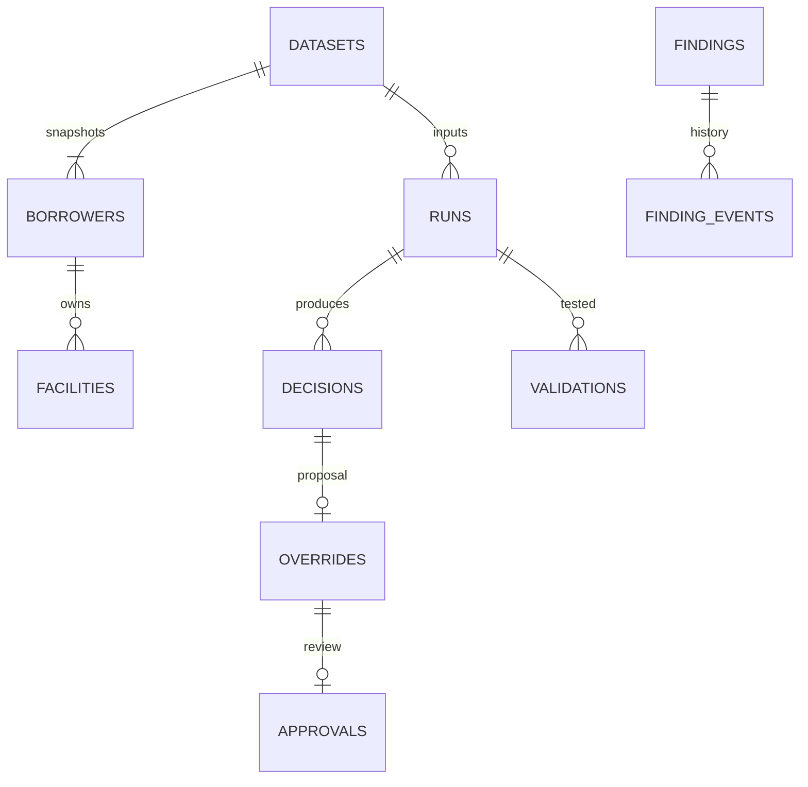

# Canonical persistence and ERD

Authority: migration `0001` with frozen `migrations/schema_v0001.py`. Runtime mapping: `credit_platform/schema.py`. PostgreSQL DDL inspection output: `deployment/schema.sql`; apply Alembic, not the informational DDL alone, because migrations also install evidence guards.

Datasets carry effective date, recorded timestamp, source, schema version, DQ and payload hash. Borrowers/facilities use composite dataset/entity primary keys; facility borrower FK includes dataset, preventing cross-snapshot joins. JSON payloads preserve original feature fields with hashes. Models/configuration store immutable content; runs snapshot their complete versions/hashes. Run→facility decisions retain source/feature/model/policy/aggregation trace. Overrides reference the composite decision key; one proposal per decision, different-person approval enforced by service. Events retain findings history without deletion. Credentials store token hashes and expiry; API database credentials cannot mutate credential records.

The schema is normalized for snapshot identity, entity relationships and governance. Source-specific feature bundles remain versioned JSON to preserve the frozen model contract without inventing unused institutional tables. Collateral/guarantee terms are embedded facility snapshot attributes in this release; separate guarantor/valuation/recovery ledgers are future capture requirements, not already implemented entities.

UTC recorded timestamps and ISO business dates are separate. Point-in-time API additionally excludes runs completed after known_at. Corrections ingest new snapshots and retain previous decisions. No endpoint updates an old source/result. PostgreSQL grants and database triggers restrict evidence mutation; DB administrators remain trusted and require external operational controls.
