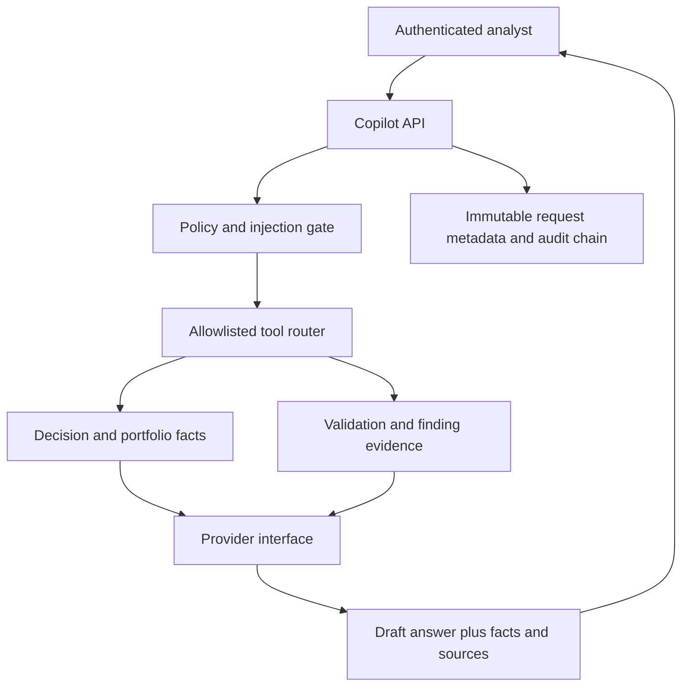

# GenAI Copilot architecture

`credit_platform/copilot.py` is isolated from the risk engines. Typed use cases select fixed SQLAlchemy queries; model-generated SQL is absent. The provider receives curated evidence after authorization and retrieval. The local deterministic implementation is the default and test oracle. The optional external JSON adapter is constructed only after explicit environment opt-in and never receives database credentials or a query capability.

The API response keeps facts, sources, tool calls and narrative distinct. Request IDs, actor/role, use case, question hash, provider/version, prompt version, status, tools, sources and response hash are stored in an append-only table introduced by migration `0002`; raw prompts and generated text are omitted. Hash-chained audit events record answered, refused and insufficient-evidence outcomes.

Current authorization is the platform's shared institutional scope. It is appropriate for the reference implementation but does not implement tenant, portfolio or relationship-manager row-level entitlements. Those require institution identity and ownership data and remain a deployment gate.
