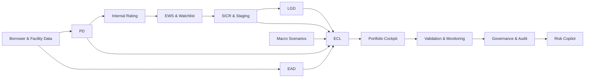

# Credit Risk Analytics, Decisioning & Model-Risk Platform

A full-stack **Credit Risk research platform** built to study how an end-to-end credit-risk lifecycle fits together: data, models, decisioning, IFRS 9-style ECL, portfolio monitoring, validation, governance, audit and grounded GenAI.

> **Research scope:** the portfolio and workout datasets are synthetic and publicly informed. The project is designed for research, learning and professional demonstration rather than live credit decisions.

## What this project covers

The repository goes beyond a standalone PD or LGD notebook. It connects the major components of a credit-risk function into one traceable system:



### Risk stack

| Layer | Implementation |
|---|---|
| **PD** | Logistic Regression reference model with Random Forest / Gradient Boosting challenger analysis, discrimination and calibration testing |
| **Internal rating** | Transparent 1–10 risk-rating framework with performing, Watchlist and default/write-off grades |
| **EWS** | Behavioural early-warning signals using utilization, persistence and limit-breach indicators |
| **Watchlist / SICR** | Separate monitoring and staging logic with explicit decision reasons and audit traces |
| **IFRS 9-style staging** | Stage 1 / 2 / 3 classification with Stage 3 precedence and documented internal policy assumptions |
| **LGD** | Facility-level workout LGD, direct benchmarks, challenger programmes, support/stability diagnostics and component-workout research |
| **EAD** | Facility-level term-loan, overdraft and trade-finance exposure mechanics |
| **ECL** | Facility-level Stage 1 / 2 / 3 expected-credit-loss calculation and borrower/portfolio aggregation |
| **Scenarios** | Upside / baseline / downside macro scenario layer with forward-looking PD effects |
| **Validation** | AUC, Gini, KS, Brier, Log Loss, calibration, bias, RMSE/MAE, support, stability, tail diagnostics, bootstrap uncertainty and reconciliation |
| **Governance** | Model registry, findings, feature contracts, overrides, approvals, promotion gates, lineage and append-only audit evidence |
| **GenAI** | Governed Risk Copilot over the same deterministic evidence used by the platform |

## The data work

Two complementary synthetic data programmes are preserved.

### Integrated synthetic bank dataset

The linked S1 dataset contains:

- **65,000 borrowers** across development, selection, final and current cohorts
- **113,012 facilities**
- **2,340,000 monthly conduct records**
- term loans, overdrafts and trade-finance facilities
- borrower financial, qualitative and behavioural features
- linked collateral and third-party guarantee contracts
- default/workout histories with dated recovery cashflows and costs
- disjoint cohorts and frozen final-evaluation evidence

See [synthetic_bank/README.md](synthetic_bank/README.md).

### WN-1 dated workout environment

The final workout research programme adds a relational, observation-time LGD environment with:

- **8,000 borrowers**
- **8,000 facilities**
- **8,000 default events**
- **66,307 credit snapshots**
- **31,815 workout snapshots**
- **74,973 collateral valuations**
- **3,896 collateral-enforcement events**
- **2,401 guarantee claims**
- **64,838 recovery transactions**
- **235,311 workout-cost records**
- **1,861 restructuring events**
- **4,628 cure events**
- **1,466 write-offs**
- **228,495 interest-accrual records**
- **6,980 resolution events**
- **164,984 macro snapshots**

The dataset preserves both effective and recorded dates so the project can reconstruct what was observable at a given LGD observation date.

See [workout_vnext/README.md](workout_vnext/README.md).

## PD and borrower risk

The PD framework combines financial, behavioural and qualitative borrower information, including:

- EBITDA margin
- leverage
- liquidity/current ratio
- debt-to-income
- collateral coverage
- years in business
- utilization
- delinquencies
- previous defaults
- days past due
- industry
- management and governance quality
- reporting quality
- market position
- sponsor support
- customer/supplier concentration
- key-person dependency
- audit quality

The project evaluates **incremental information**, rather than simply adding variables until AUC rises. Null and negative challenger results are retained.

The frozen V5 PD holdout reproduces approximately:

- ROC-AUC **0.7595**
- Gini **0.5189**
- KS **0.4085**
- Brier **0.0300**
- Log Loss **0.1286**
- observed default rate **3.40%**
- mean predicted PD **3.44%**

## EWS, Watchlist, SICR and staging

The monitoring layer separates borrower deterioration from accounting stage classification.

It includes:

- six-month utilization movement
- persistent high utilization
- limit breaches
- Watch / Deteriorating EWS states
- Watchlist treatment
- SICR reasons
- DPD and impairment triggers
- Stage 1 / Stage 2 / Stage 3
- internal 1–10 risk rating
- borrower/facility decision traces

The project's nine-month EWS persistence treatment is an **internal research policy assumption**, not a regulatory requirement.

## LGD research programme

LGD became the main model-risk research stream in the project.

The repository preserves the full sequence instead of hiding failed experiments:

1. **V5 facility workout LGD** — Gradient Boosting reference model.
2. **Independent tail validation** — investigated severe realized-loss behaviour.
3. **Support / guarantee diagnostics** — identified population-support differences.
4. **R2 challengers and oracle diagnostics** — separated model limitations from unavailable information.
5. **S1 integrated data programme** — rebuilt linked borrower/facility/workout populations.
6. **Observable-economic S2 research** — tested prediction-time economic information.
7. **S2-R1 constrained challenger** — added scenario and support controls.
8. **Post-R1 hardening** — rejected calibration changes that worsened other gates.
9. **Marginal Interest experiment** — tested impaired-facility interest as an incremental workout signal; incremental value was inconclusive.
10. **WN-1 workout engine** — built a dated component-based recovery architecture with cure, recovery channels, timing, costs, collateral, guarantees and macro vintages.

The research story is not simply a search for a lower RMSE. It demonstrates **model challenge, failed promotion, evidence preservation, controlled experimentation and governance**.

See:

- [MODEL_INVENTORY.md](MODEL_INVENTORY.md)
- [WORKOUT_PLATFORM_CLOSEOUT.md](WORKOUT_PLATFORM_CLOSEOUT.md)
- [workout_vnext/FINDINGS.md](workout_vnext/FINDINGS.md)
- [FINAL_INDEPENDENT_VALIDATION_REPORT.md](FINAL_INDEPENDENT_VALIDATION_REPORT.md)

## EAD and ECL

The calculation chain is facility-level.

- Term-loan EAD uses current drawn/outstanding exposure.
- OVD EAD uses the approved limit.
- Trade-finance exposure uses transparent CCF assumptions.
- Stage 1 uses 12-month forward-looking PD.
- Stage 2 uses a lifetime-PD approximation over remaining facility maturity.
- Stage 3 uses PD = 100% with workout LGD.
- Facility results aggregate back to borrower and portfolio views.

The reference portfolio reconciles **5,172 facilities** with:

- EAD approximately **2.092bn**
- ECL approximately **45.27m**
- **0 stage mismatches**
- independently reproduced PD/LGD/EAD/ECL arithmetic

A methodology bridge is retained so ECL movements can be decomposed between LGD changes and facility-term mechanics rather than reported as one unexplained number.

## Portfolio Cockpit and Borrower Credit File

The Streamlit workbench contains:

### Portfolio Cockpit
- borrower and facility counts
- EAD and ECL
- Stage mix
- direct vs indirect exposure
- utilization
- industry and product concentrations
- risk ratings
- risk direction
- Watchlist / SICR
- unsecured and guaranteed exposure
- portfolio review signals

### Borrower Credit File
- borrower profile
- PD and rating
- EWS / Watchlist / SICR
- stage and stage reasons
- facility product/exposure
- LGD / EAD / ECL
- collateral and guarantee context
- decision trace

### Risk Management
- governed overrides
- maker/checker approval
- macro-scenario review
- permissions
- audit trail

### Model Validation
- PD discrimination and calibration
- LGD performance and calibration
- support / stability analysis
- challenger evidence
- ECL bridges
- model findings and promotion decisions

## Governed Risk Copilot

The GenAI layer sits **on top of governed evidence** rather than replacing the risk engine.

It can answer questions such as:

- Which industries deserve attention and why?
- What are the largest ECL concentrations?
- Why is this borrower in its current stage?
- What are the borrower's main risk drivers?
- What LGD validation findings remain open?
- Why was a challenger not promoted?

The same canonical service layer supplies the portfolio facts used by the platform and the Copilot.

Controls include:

- deterministic numerical grounding
- evidence references
- RBAC
- allowlisted use cases
- prompt-injection refusal
- human-review requirement
- append-only request metadata
- no autonomous approval
- no model promotion
- no model modification
- no unrestricted generated SQL

Provider options:

- deterministic local provider
- local **Ollama**
- **OpenAI**
- explicitly configured external JSON provider

## Engineering and governance

The repository also includes:

- canonical domain models
- SQLite local reference execution
- PostgreSQL persistence
- Alembic migrations
- FastAPI
- Streamlit
- Docker / Docker Compose
- role-based access
- expiring/revocable credentials
- model and configuration hashing
- dataset hashes
- feature contracts
- append-only audit evidence
- two-person override control
- model registry and findings
- CI validation workflows
- reproducible research locks and manifests

## Final verification

The final integration branch is:

```text
release/final-institutional-platform
```

Latest verified engineering evidence:

| Check | Result |
|---|---|
| Full automated suite | **230 passed** |
| V5 release checks | **30 / 30 passed** |
| Reference shadow calculation | **5,172 facilities reconciled** |
| Stage mismatches | **0** |
| Audit chain | **VERIFIED** |
| PostgreSQL migrations | **PASS** |
| WN-1 PostgreSQL persistence | **VERIFIED** |
| Docker image build | **PASS** |
| Streamlit headless startup | **PASS** |
| Full V5 GitHub workflow | **PASS** |
| Platform GitHub workflow | **PASS** |

Historical branches, rejected challengers and research evidence remain separate and traceable.

## Repository map

```text
Credit-Risk-Analytics/
├── app.py                         # Streamlit risk workbench
├── src/                           # PD, LGD, EWS, rating, EAD/ECL logic
├── credit_platform/               # API, persistence, governance, audit, Copilot
├── synthetic_bank/                # linked synthetic bank dataset
├── workout_vnext/                 # dated component-workout LGD research
├── marginal_interest/             # Marginal Interest experiment
├── lgd_research/                  # LGD research programme
├── economic_lgd/                  # observable-economic LGD research
├── s2_remediation/                # constrained LGD challenger
├── lgd_hardening/                 # post-R1 validation / controls
├── validation_review/             # independent review evidence
├── migrations/                    # Alembic database migrations
├── tests/                         # automated validation and platform tests
├── docs/                          # historical methodology documentation
├── outputs/                       # reproducible model / validation outputs
└── .github/workflows/             # CI validation
```

## Run the project

Use **Python 3.12**.

### Windows PowerShell — quickest full demo

```powershell
git clone https://github.com/adel3amr/Credit-Risk-Analytics.git
cd Credit-Risk-Analytics
git checkout release/final-institutional-platform

py -3.12 -m venv .venv
Set-ExecutionPolicy -Scope Process Bypass
.\.venv\Scripts\Activate.ps1

python -m pip install --upgrade pip
pip install -r requirements-platform-lock.txt

python scripts/run_v5.py
python -m credit_platform.cli build-models
python -m alembic upgrade head

python -m credit_platform.cli issue-token --name analyst --role analyst
python -m credit_platform.cli issue-token --name manager --role manager
python -m credit_platform.cli issue-token --name validator --role validator
python -m credit_platform.cli issue-token --name auditor --role audit
python -m credit_platform.cli issue-token --name admin --role admin

python -m credit_platform.cli seed-governance
python -m credit_platform.cli run-reference --operator analyst

python -m streamlit run app.py
```

Then open the local Streamlit URL shown in PowerShell, normally:

```text
http://localhost:8501
```

The default Copilot provider is deterministic and requires no external API.

### Optional local Ollama Copilot

With Ollama installed and `llama3.2` available:

```powershell
$env:COPILOT_PROVIDER="ollama"
$env:OLLAMA_MODEL="llama3.2"
python -m streamlit run app.py
```

### Optional OpenAI Copilot

```powershell
$env:COPILOT_PROVIDER="openai"
$env:OPENAI_API_KEY="YOUR_KEY"
python -m streamlit run app.py
```

Never commit API keys or issued platform credentials.

### Run the verification suite

```powershell
python -m pytest -q
python scripts/validate_v5.py
python scripts/platform_shadow.py
python -m credit_platform.cli audit-verify
```

### Docker / PostgreSQL

Create a local ignored `.env` with separate random passwords for `POSTGRES_PASSWORD` and `APP_DB_PASSWORD`, then:

```bash
docker compose up --build -d
```

See [REPRODUCIBILITY.md](REPRODUCIBILITY.md) and [DEPLOYMENT_OPERATIONS.md](DEPLOYMENT_OPERATIONS.md) for the full reference deployment workflow.

## Documentation

Start here:

- [Final platform consolidation](FINAL_INSTITUTIONAL_PLATFORM.md)
- [Architecture](TARGET_ARCHITECTURE.md)
- [Executive architecture summary](EXECUTIVE_ARCHITECTURE_SUMMARY.md)
- [Data dictionary](DATA_DICTIONARY.md)
- [Database schema](DATABASE_SCHEMA.md)
- [API documentation](API_DOCUMENTATION.md)
- [Model inventory](MODEL_INVENTORY.md)
- [Feature contracts](MODEL_FEATURE_CONTRACTS.md)
- [Independent validation](FINAL_INDEPENDENT_VALIDATION_REPORT.md)
- [External evidence register](EXTERNAL_EVIDENCE_REGISTER.md)
- [GenAI Copilot guide](GENAI_COPILOT_GUIDE.md)
- [GenAI controls](GENAI_RISK_AND_CONTROLS.md)
- [Reproducibility](REPRODUCIBILITY.md)

## Research history

The project intentionally preserves model and research history instead of presenting only the final polished result.

Important branches include:

```text
review/final-red-team-release
research/lgd-marginal-interest-workout
research/lgd-workout-engine-vnext
feature/integrated-streamlit-copilot
release/final-institutional-platform
```

That history is part of the project: it shows how hypotheses were challenged, how adverse evidence was handled, how models were rejected when they failed gates, and how the final platform was assembled without rewriting earlier results.

---

**Project purpose:** Credit Risk research, model-risk practice, software engineering and professional demonstration using synthetic and publicly informed data.
