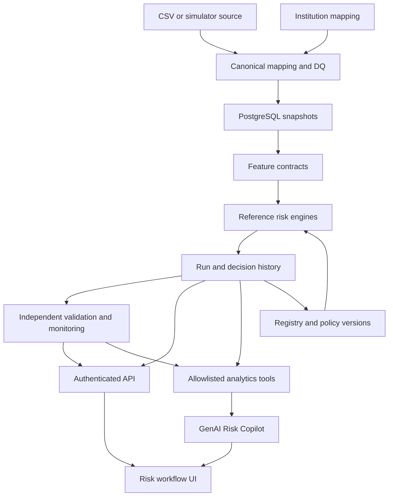

# Target architecture

A modular monolith with a portable SQLAlchemy persistence boundary and FastAPI service. Reference engines reuse frozen methodology; changes are additive, governed and explicitly versioned. The existing demo remains available for historical reproduction.

Canonical entities: datasets with effective/recorded dates; borrower and facility snapshots tied to dataset; security fields tied to facilities; models with hashes/status; configurations/scenarios; runs; facility decision traces; findings and append-only events; overrides with proposal and separate approval; credential principals and audit events. Recovery/outcome data stay separate from prediction-time inputs and can be submitted to the validation module, never to scoring features.

PostgreSQL is the deployment target. SQLite is a constrained single-process test/development alternative, not evidence of PostgreSQL operations. Migrations are forward-only; recovery restores a backed-up database. Application credentials cannot select roles. Reference runs are available to analysts; model and policy promotion are blocked until required external evidence exists. A shared institutional scope is explicit; this release does not advertise multi-tenancy.

Version separately: application, schema, feature contract, PD artifact, LGD artifact, EAD policy, staging/EWS/rating policy, scenario, ECL implementation, validation and generator. Record business-effective date and system-recorded time; corrected snapshots create new versions.

The Copilot is a separate narrative module above governed outputs. It can retrieve a run's portfolio aggregation, a borrower's stored decision traces, or the authoritative model-risk decision. It has no scoring function, SQL-generation path, override/approval permission, or model-promotion path. The default provider is local and deterministic; external transmission requires explicit configuration.
