# From aggregate calibration to tail risk

## Diagnosing facility-level LGD through data and model experiments

**Research study · 24 September 2026 · controlled synthetic experiment · published V5 reference `0dfe4c8`**

### Abstract

We reconstructed the frozen V5 facility workout LGD model, reproduced its 2,000-facility MAE 11.40 pp and near-zero mean bias −0.31 pp, and showed why the 327 realized losses above 75% still have −15.59 pp mean underprediction. The original workout training data contain almost no facilities with zero guarantee coverage even though 79.2% of active synthetic facilities have zero. A new separately versioned economic recovery generator adds security quality, guarantor strength, correlated downturns and stochastic resolution. We froze 9,000 development, 3,000 model-selection and 3,000 final-holdout cases before model comparisons. On the final synthetic holdout, the original-H-trained V5 model has MAE 12.77 pp, RMSE 17.65 pp and severe-realization bias -12.74 pp. The enhanced two-stage research challenger has MAE 11.13 pp, RMSE 15.69 pp and severe-realization bias -12.05 pp. Its paired overall RMSE difference has a 95% bootstrap interval of [-2.27, -1.63] pp against transferred V5. A non-deployable oracle with future workout information has MAE 4.05 pp, supporting an information-set limitation in this *synthetic* economy. The new proxy features do not exist in the live V5 source. No challenger is promoted, and bank production use remains blocked pending real recovery data and approval.

## 1. Research question and governance

The goal is to explain the observed loss-tail weakness and compare data and method changes, not to fit a known metric. The published V5 branch at `0dfe4c8` is unchanged; all scripts, datasets, fitted research objects and results live under `lgd_research/` on a separate research branch. H historical data and the original 2,000-case holdout have been repeatedly viewed, so they serve as reference diagnostics, never a fresh final selection set. `FINAL_EVALUATION_LOCK.md` records the candidates and the SHA of the final holdout before evaluation.

## 2. Existing framework and independent reproduction

V5 uses a fixed 220-tree Gradient Boosting regressor with six numeric and four categorical features. Its target is bounded economic LGD `clip(1 − discounted net cash recoveries/EAD, 0, 1)`. Source-independent recalculation of the V5 predictions yields MAE .11396453, RMSE .16579849 and prediction-minus-realization bias −.00305172 on 2,000 original holdouts. For 327 realized LGDs >.75, bias is −.15592783; for the top 200 by **predicted** LGD it is −.02534385. The latter is a deployable cohort; the former is known only after resolution. Source integrity, independent accounting identities and history are detailed in `LGD_ROOT_CAUSE_ANALYSIS.md` and the earlier whole-repository review.

## 3. Why the aggregate score conceals the tail

The original 391 outcomes ≤20% contribute +79.01 percentage-error units; the 526 between 20–40% contribute another +19.18. Outcomes above 40% collectively contribute −104.30, leaving total −6.10 / 2,000 = −.00305. Cures (322) contribute +88.39 units and non-cures (1,678) −94.49. Conditional-mean predictions tend to lie between divergent eventual outcomes. Neither this identity nor the oracle alone proves that a given bank's extreme losses are irreducible; it tests the synthetic information set.

## 4. Severe-loss population and support

Original H development has 980 >75% cases and 1/6,000 exactly zero guarantees; original H holdout has 327 >75% and zero exact zero guarantees. Current V5 facility data show 4,096/5,172 zero guarantees. Separate R2 development contains 1,447 >75% cases and 5,414/9,000 zero guarantees. R2 selection has 491 >75% and 1,796/3,000 zero guarantees. Original H to R2 transfer alters outcomes and input mix, so a favorable score is not retrospective V5 improvement. The feature-support audit covers quantiles, missingness and every categorical level in `results/feature_support.csv` and `LGD_FEATURE_SUPPORT_MATRIX.md`. Most importantly, R2's new quality proxies are absent in the current scoring portfolio.

## 5. Economic recovery process and prediction time

R2 generates EAD, sector, product, borrower financial condition, collateral coverage/type/legal quality, guarantee coverage/strength and downturn state at **default**, before workout. Future random market, guarantee and collection shocks affect the realized component recoveries; stochastic cure, length and costs affect dated net cash flows at months 1, 6, 12, 24, 36 and 60. Each component is capped by residual EAD, then the cash flows are discounted using a facility rate. Correlated downturn lowers recoveries while increasing delays and costs. `lgd_research/generate_r2.py` documents every coefficient; none is a regulatory or empirical bank estimate. `LGD_DATA_GENERATION_REGISTER.md` was written before R2 creation. Hashes and seeds appear in `results/dataset_hashes.csv`. R2 final holds 3,000 observations and was evaluated only after the precommitted lock. The generator tests recalculate PV and LGD independently. Future cure, shock, realized recoveries and timing are explicitly excluded from deployable features.

## 6. Comparative designs and data-vs-method attribution

For the controlled 2×2, original H and R2 each contribute 6,000 training cases; both are scored on the same R2 selection set. A is unchanged V5 trained on H; B is unchanged V5 trained on R2; C is common-input two-stage trained on H; D is common-input two-stage trained on R2. Their RMSEs are 0.17574, 0.17030, 0.17816 and 0.16982. Data effect B−A = -0.00544; method effect C−A = +0.00241; interaction D−B−C+A = -0.00290. These are differences of scores under *different synthetic recovery processes* and not causal estimates for a bank. Holding R2 data fixed, enhanced input features reduce RMSE from 0.16983 to 0.15366; this bundles information availability and interaction with the estimator. The new inputs are not available to live V5, so no deployed improvement follows.

## 7. Baselines, challenger methodology and leakage

The simple collateral/product segment mean has much higher RMSE than V5 on R2 selection. A later completeness check also transferred the *original simple collateral proxy* to the already viewed selection sample, using the original mean unsecured severity but no future random residual; its MAE 22.22 pp and realized >75 bias -25.85 pp are retrospective baseline diagnostics, and it was not added to the locked final contender set. Fixed alternatives include unchanged Huber and Random Forest; the enhanced GB adds synthetic observable-at-default information; the two-stage mixture models the *probability* of a >75% regime then recombines conditional expected losses; the component approach separately predicts recoveries, costs and duration under an EAD cash budget. These are research methodology changes and do not affect ECL. The p90 conditional quantile illustrates an upper-risk bound, **not** an unbiased expected loss: its large aggregate positive bias is therefore unsurprising. The oracle alone sees future cure, resolution duration and realization shocks; it is non-deployable by design. Target and postdefault recovery values never enter deployable candidate features.

## 8. Ablation and information sufficiency

On R2 selection, enhanced GB RMSE is 0.15366. Removing collateral-related inputs raises it to 0.22261, guarantees to 0.15910, borrower inputs to 0.16061, and the three new quality/downturn proxies to 0.16983. Removing facility size/product makes little difference in this synthetic generator (0.15354). These are conditional model perturbations, not causal effects. The oracle's large advantage supports the specific hypothesis that future workout variability is informative but hidden at prediction time; adding postdefault outcomes to a deployable model would be leakage.

## 9. Final holdout: all finalists on identical facilities

The following results use only the frozen 3,000-case R2 final sample. Each tail has its own N and exposure denominator; the detailed cohort and EAD-weighted figures are in `results/final_scorecard.csv` and paired uncertainty in `results/paired_bootstrap.csv`.

| Model | N | EAD m | MAE pp | RMSE pp | Bias pp | >75 N | >75 EAD m | >75 bias pp | >90 bias pp |
|---|---:|---:|---:|---:|---:|---:|---:|---:|---:|
| A V5 H | 3,000 | 1669.4 | 12.77 | 17.65 | -0.82 | 536 | 295.5 | -12.74 | -16.66 |
| V5 R2 full | 3,000 | 1669.4 | 12.77 | 17.16 | +0.09 | 536 | 295.5 | -16.45 | -21.94 |
| GB enhanced R2 | 3,000 | 1669.4 | 11.14 | 15.66 | +0.09 | 536 | 295.5 | -13.40 | -15.08 |
| two-stage enhanced R2 | 3,000 | 1669.4 | 11.13 | 15.69 | +0.22 | 536 | 295.5 | -12.05 | -12.31 |
| component R2 | 3,000 | 1669.4 | 10.97 | 15.76 | +0.27 | 536 | 295.5 | -13.18 | -16.19 |
| oracle FUTURE INFORMATION | 3,000 | 1669.4 | 4.05 | 5.25 | +0.10 | 536 | 295.5 | -3.51 | -6.51 |
| quantile p90 RISK ONLY | 3,000 | 1669.4 | 15.28 | 21.61 | +14.45 | 536 | 295.5 | +3.22 | -1.06 |

These severity cohorts are retrospective. Forecast-decile calibration and the *fixed V5 forecast-selected* top decile must be reviewed separately; they are not interchangeable. Paired bootstrap draws resample facility rows under the synthetic iid assumption and therefore omit generator misspecification, shared-borrower dependence and bank-specific uncertainty.

## 10. Economic stress and sensitivity

Under the same random seed, a combined synthetic downturn raises realized mean LGD by 25.42 pp. The H-trained V5 forecast responds by 0.00 pp because its available inputs omit the added downturn/security-quality indicators; the enhanced GB responds by 12.24 pp. Remaining gap includes shocks that are genuinely unobservable when scoring. Separate collateral, guarantee, recovery, timing and cost stresses are all recorded in `results/stress_responses.csv`. Stress responses reveal risk sensitivity, not a claim that the real portfolio will undergo these shifts.

## 11. Model risk and decision

The R2 challengers improve several synthetic metrics but do not remove severe-outcome error. R2's new observable-at-default proxies are absent in the current portfolio; R2 is a constructed data-generating process with one independent seed rather than multiple real economic vintages. The conditional quantile is useful as a **separate research risk bound**; adding it to ECL as an overlay would require explicit policy and quantitative allowance-impact approval. Accordingly the decision is **retain published V5 as an educational benchmark, do not promote a challenger, and retain the blocked bank-use gate**. The substantive research outcome is **G: further redevelopment required**, with an identified synthetic information limitation. This is a model governance decision rather than a numerical declaration that no better model can exist.

## 12. Production gate, monitoring and limitations

`scripts/assess_bank_readiness.py --purpose bank` still blocks use. Future use requires real facility-level collateral/guarantee documentation, recovered cash-flow vintages, a time-aligned prediction timestamp, independent out-of-time tests and an authorized methodology decision. `MONITORING_SPECIFICATION.md` defines input provenance, drift, resolution lags, cohort calibration, tail EAD and independent escalation without invented numeric approval thresholds. No external accounting-compliance or institutional performance claim is made. The synthetic generator encodes chosen assumptions; results can overstate how much quality inputs will help on unknown real populations. One holdout plus bootstrap uncertainty cannot solve that transport problem.

## 13. Reproducibility and audit trail

Use `REPRODUCIBILITY.md`, `LGD_EXPERIMENT_REGISTER.md`, `LGD_METHODOLOGY_CHANGELOG.md`, `LGD_FINDINGS_REGISTER.md`, the frozen lock, versioned data and manifest hashes. All displayed percentages are percentages of loss or percentage-point errors, not euros. Historic source results remain tied to commit `0dfe4c8`; this research branch does not merge model changes into V5.

## Appendix: diagnostic figures

All 18 charts are generated directly from selection data by `figures.py`. They are research diagnostics and never replace the quantitative scorecards. Figures 1–3 show scatter/residuals, 4–9 calibration, band and EAD distributions, 10–12 feature support, 13–16 challenger/cancellation/ablation/oracle evidence, and 17–18 stress and data/method attribution.

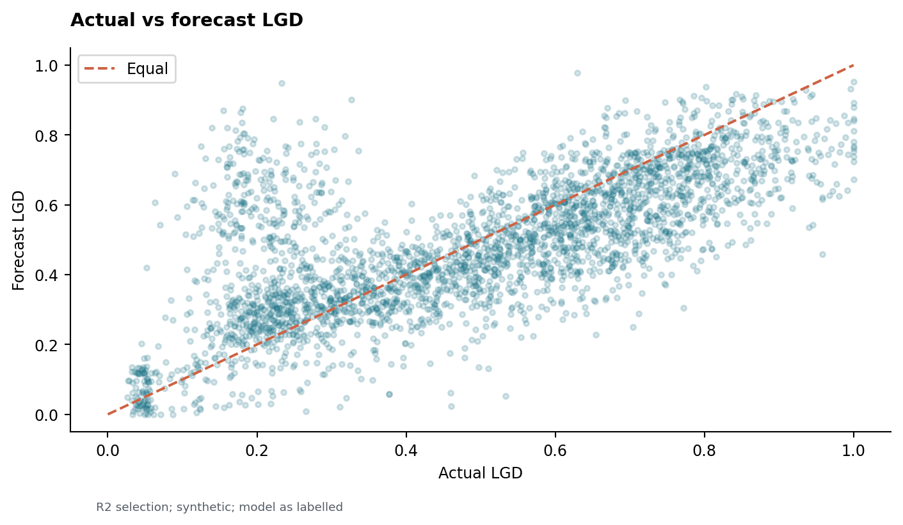

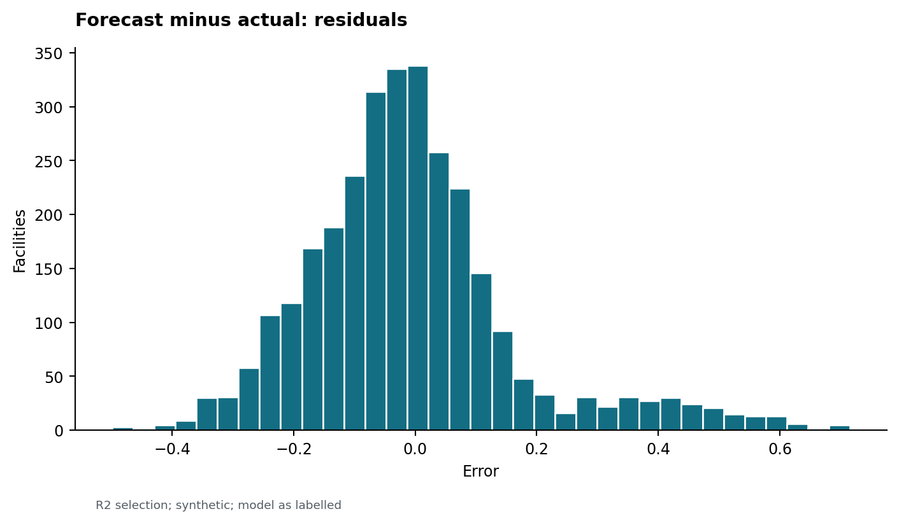

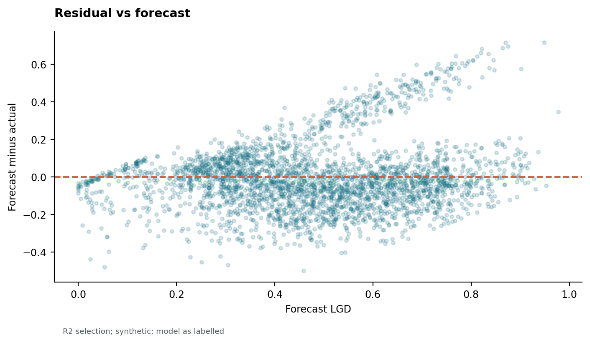

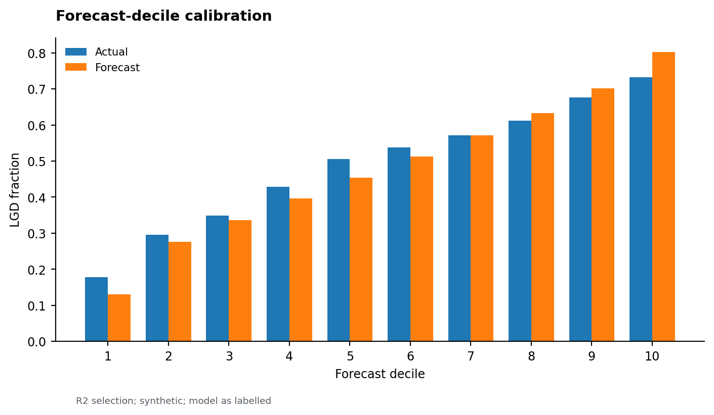

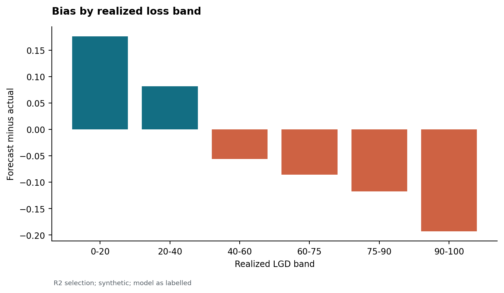

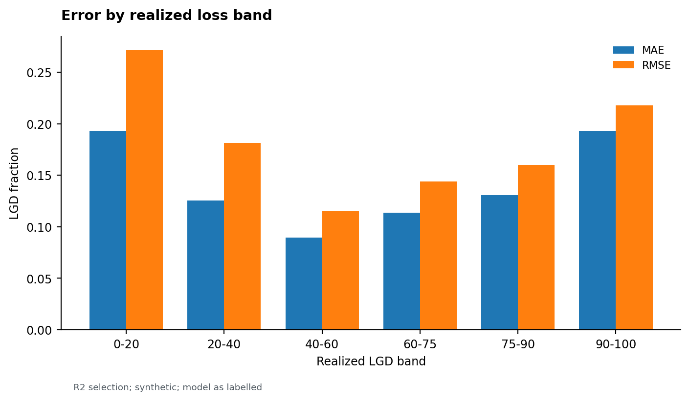

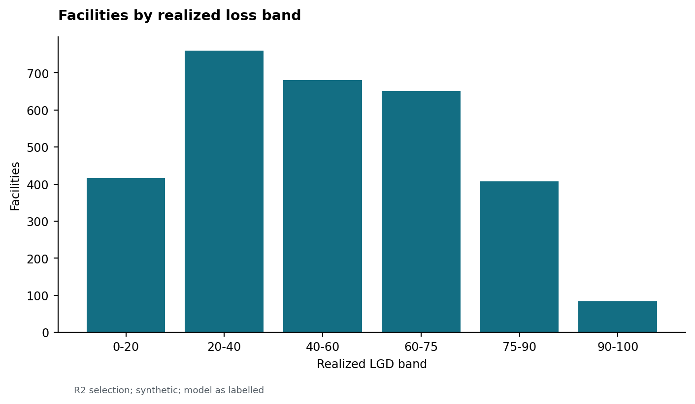

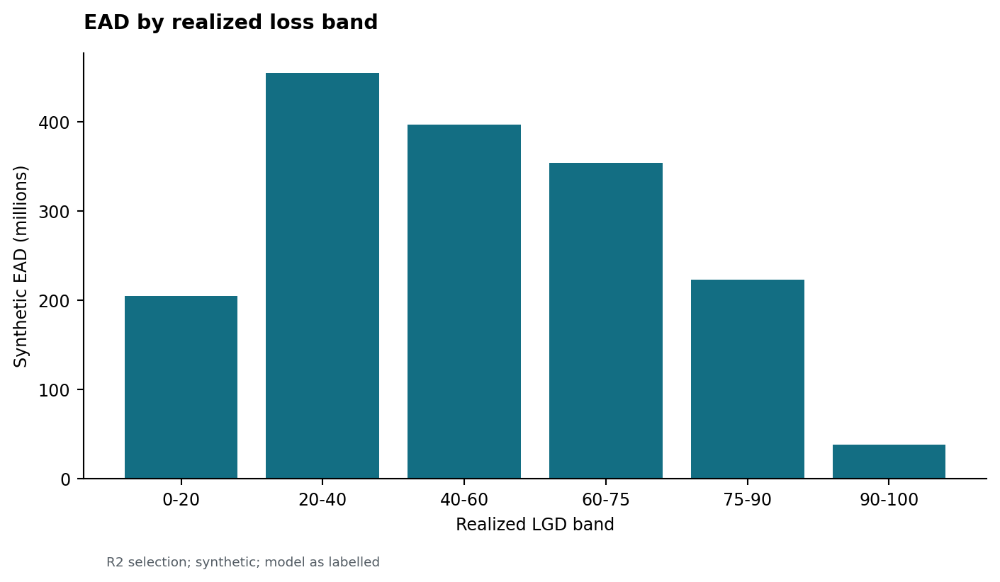

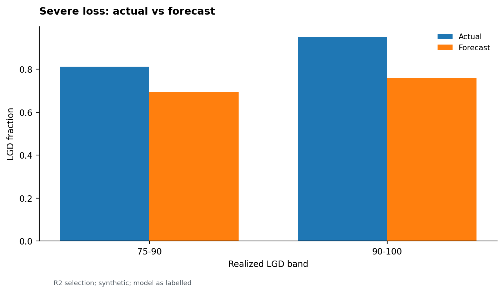

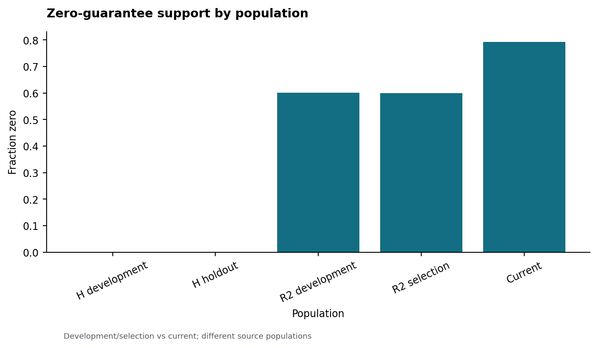

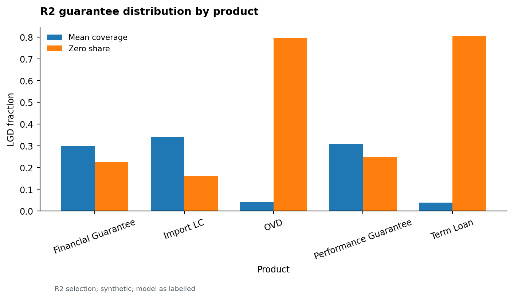

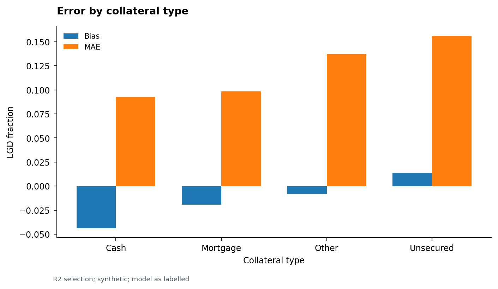

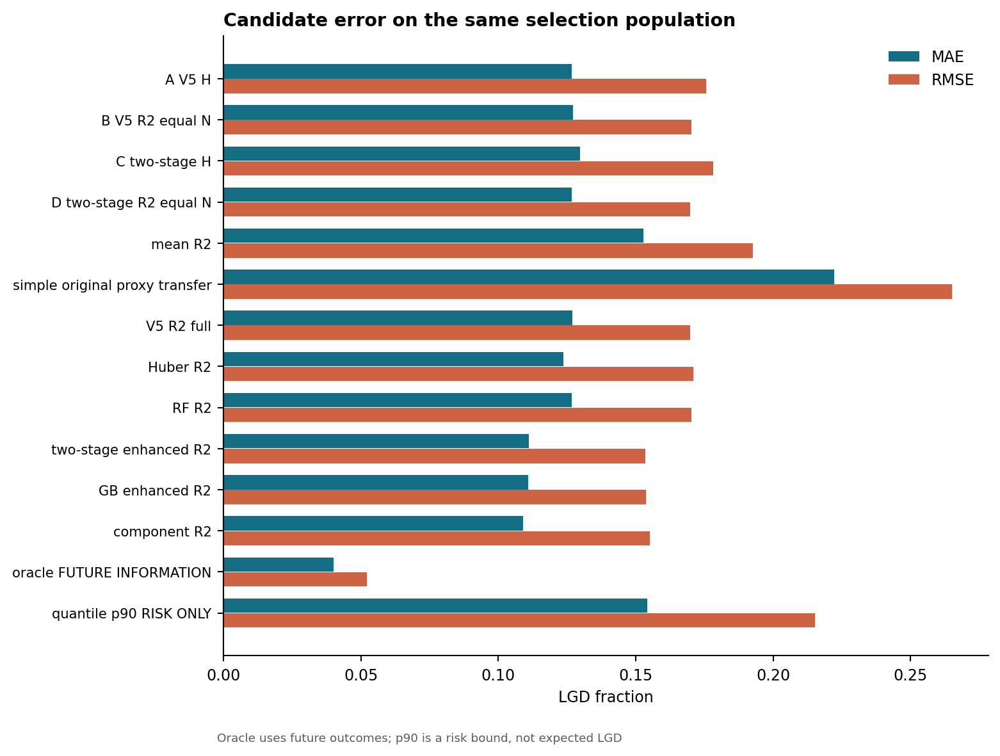

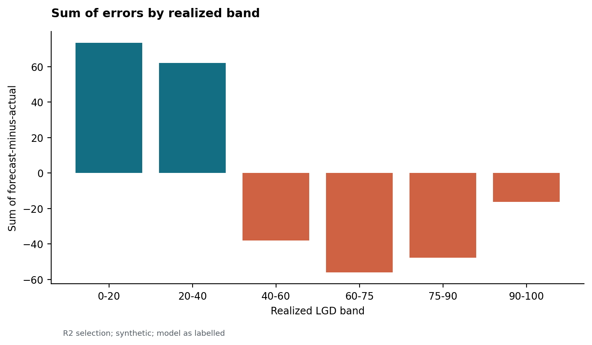

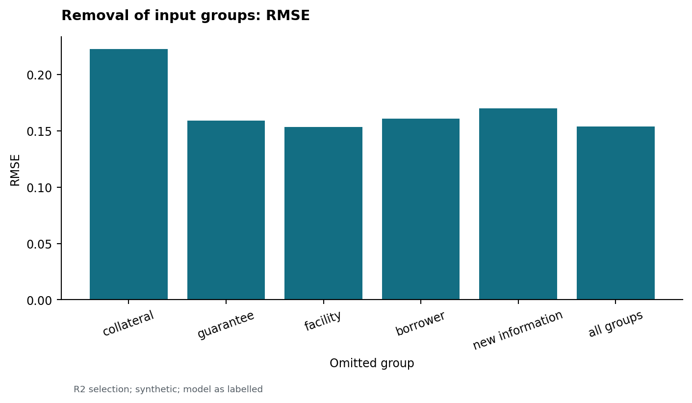

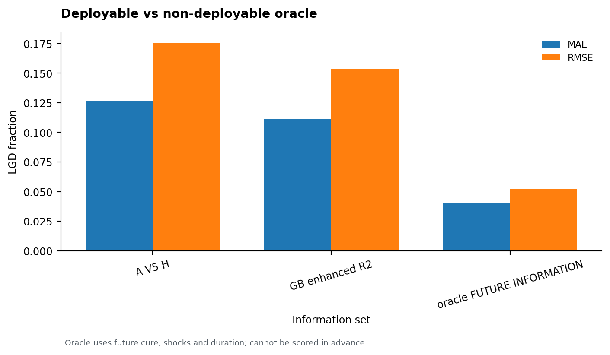

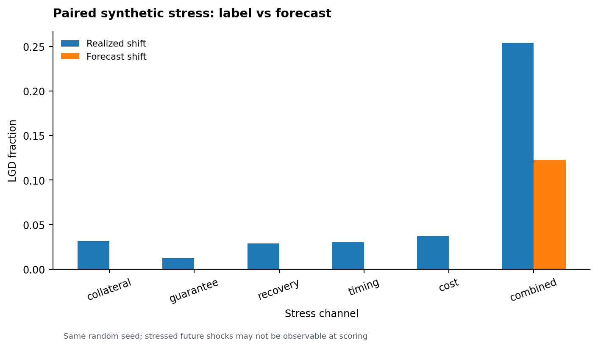

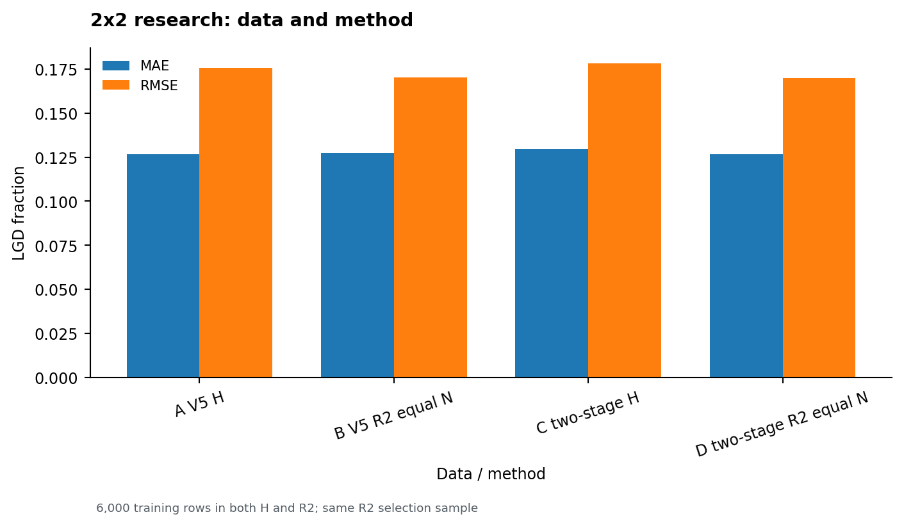
