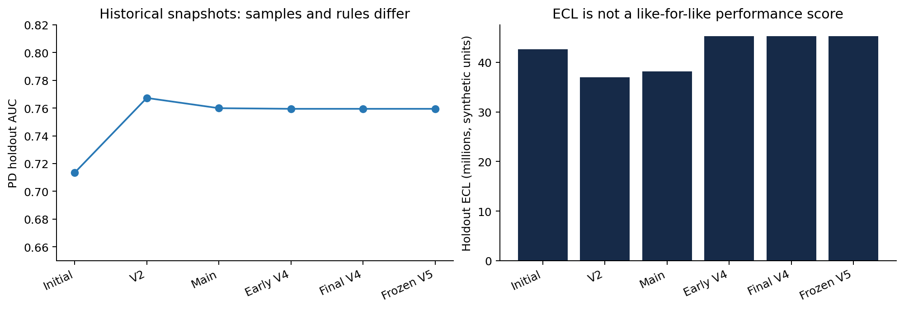
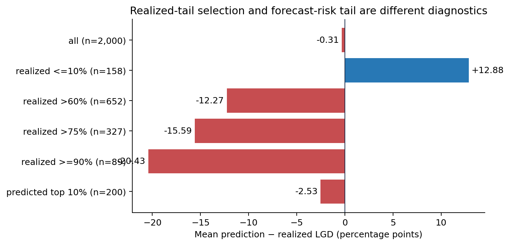
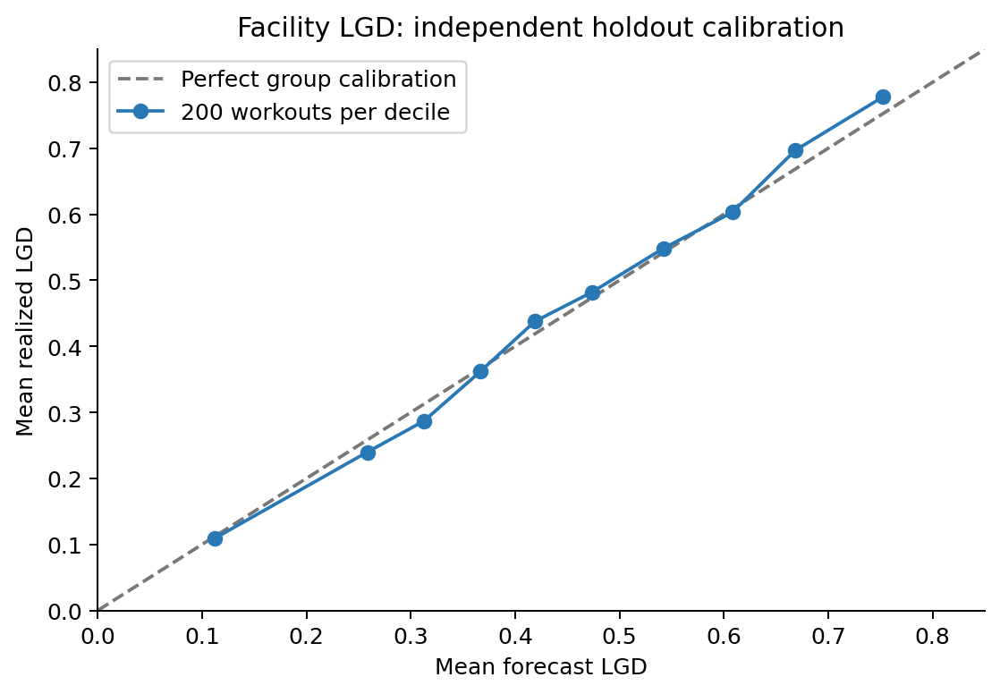
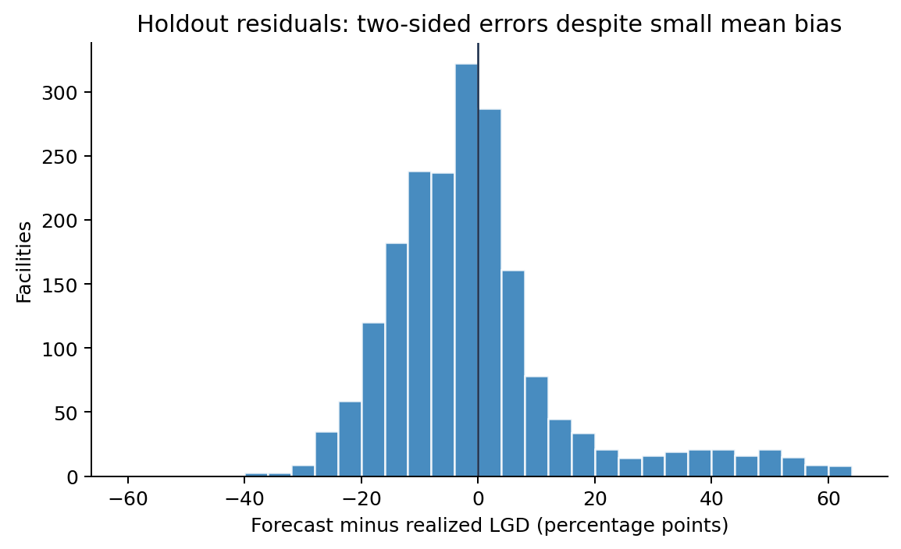
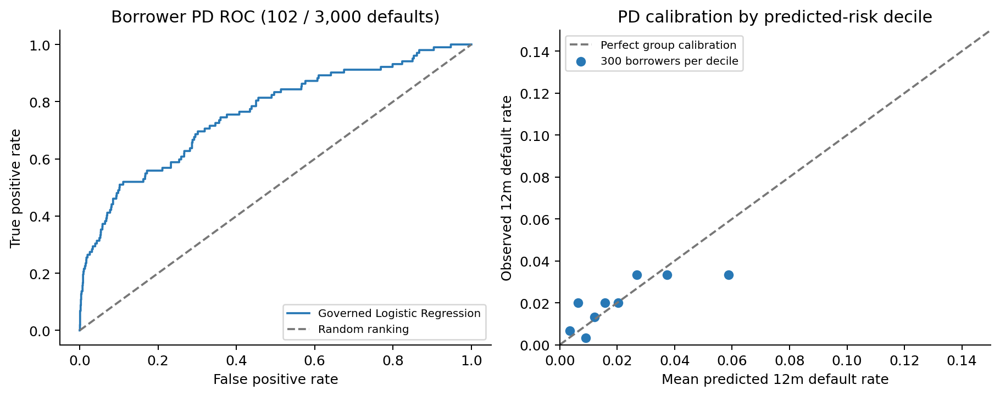
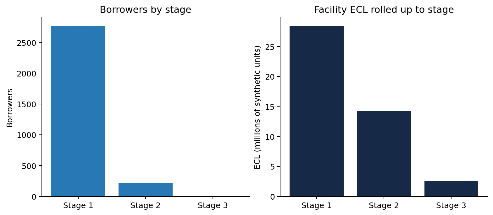
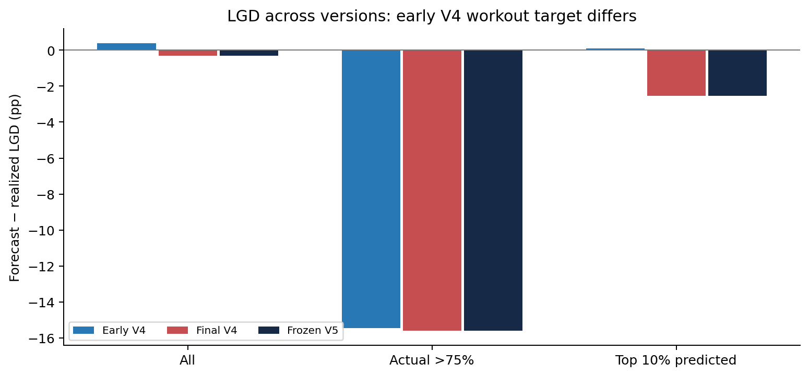

# Credit Risk Analytics & IFRS 9 Decisioning System — V5
## Forensic reconstruction and independent implementation validation

**Review date:** 23 September 2026. **Frozen reference:** `0dfe4c883a8314704394c49fa096dfb45525096c`. **Review branch:** `review/independent-system-validation`. **Disposition:** Implementation validated on synthetic data; high-loss conditional LGD limitation remains open. No approved methodology changed.

### Abstract

We reconstructed 299 commits, inspected 26 remote branches and pull requests, executed 15 representative historical snapshots from clean archives and rebuilt frozen V5. Separate code recalculated holdout PD, workout LGD, EWS and stage assignments, scenario PDs, workout recovery targets, and facility/borrower ECL. Frozen V5 passed 27 tests, 30 release checks and a dashboard smoke test across five role views. On 2,000 resolved-workout holdouts, governed facility LGD MAE is 0.113965, RMSE 0.165798 and mean prediction-minus-realization error −0.003052. For 327 **realized** LGDs >75%, bias is −0.155928; for the top 200 **predicted** LGDs it is −0.025344. Selection on the realized outcome magnifies negative errors even for a conditional-mean forecast. Cure uncertainty and stochastic recovery indicate a material data/information-set limitation; no observed accounting or mapping defect warrants an unapproved model change. This is a synthetic decisioning demonstration, not evidence of live-bank performance or certification of accounting compliance.

## 1. Scope and independence

Repository history and executable source, rather than earlier narrative claims, are primary evidence. We compared V4, V5, main, abandoned remediation and separate experiments. `git archive` extracted each checkpoint into an isolated directory to avoid stale generated outputs. `tools/independent_recalculation.py` imports no production validation/model function: it uses direct arrays, ranked AUC, raw cash flows and independently transcribed approved policy identities. This is **computational** independence, not an institutionally independent audit. Historical source and the frozen production commit remain untouched. Synthetic samples do not constitute real-world validation.

Evidence inventory: `evidence/commit_history.csv` (all 299 commits), `branches.csv`, `pull_requests.json`, `phases.csv`, `capability_matrix.csv`, `test_inventory.csv`, `historical_reproduction.csv`, `frozen_source_hashes.csv`, independent calculations and the charts. Historical execution covers selected representative checkpoints, whereas commit/branch inventory covers available repository history. Unmerged branches are not approved V5 features. Metrics across changed generators, populations and rules are not like-for-like improvements.

## 2. Historical reconstruction

| Phase and source | Implementation shift | Assessment |
|---|---|---|
| Initial `4d91d1e` | Supplied portfolio, balanced classifiers, best holdout-AUC model selection, PD-cutoff stages, 2.5×/4× ECL multipliers | Reproduced; initial default share 10.54%. Staging semantics and target mix differ from V5. |
| V2 `29ede62` | Seeded borrower generator, fixed logistic PD, current-state staging, macro scenarios, 36-month EWS and internal nine-month persistence | Reproduced. Earlier `4833e84`/`03c1db0` had removed substantive CI invariants; tests were subsequently restored. |
| V3 `a78bfe9` through main `b93a459` | Streamlit governance workbench, operational ratings, collateral recognition, product limits and CCF | Reproduced representative snapshots. Main predates V4/V5; demo identities do not constitute authentication. |
| PRs 18–21 | PCA, 2,000 paired bootstrap resamples, five-bin training-only WOE scorecard with 0.5 smoothing, stress sensitivity | Separate branches; executable experiments reproduced; none is a governed V5 component. |
| PR 22 `cfce69a` | Broader generator/feature/ECL remediation | Closed unmerged; its numbers cannot be ascribed to V5. |
| PR 23 `a90db85` | Code-only remediation from main | Actual V4 base, rather than PR 22. |
| Early V4 `c85cdab` to V4 `4f87d21` | Independent synthetic qualitative inputs; 8,000 resolved workouts, facility LGD/ECL, recovery diagnostics/challengers | Early holdout LGD MAE 0.12123, final V4 0.11396; not proof of generalization. |
| V5 `33c60ee` to `0dfe4c8` | Train/holdout stability, common-cohort tail checks, realized-tail and legacy-proxy diagnostics, release and interface checks | Governed PD/LGD metrics and EAD/ECL totals equal final V4 in clean reruns. V5 primarily improves observability and release integrity. |

Selected historical runs appear in `evidence/historical_reproduction.csv`. V2 AUC 0.76729, main AUC 0.75991 and V5 AUC 0.75946 reflect changed data and rules, not a controlled decline. The initial prototype's AUC 0.71341 applies to a different default mix. Final V4 and V5 share the same seeded 3,000-borrower holdout, 102 future defaults, EAD 2,091,914,076.05 and ECL 45,265,972.05 synthetic currency units.

## 3. Frozen methodology and information flow

The generator creates 12,000 borrowers and 36 monthly behavior observations for each; a distinct 8,000-facility resolved-default history supplies discounted workout LGD targets. PD development/holdout splitting is stratified 75%/25% with seed 42. LGD uses 75%/25% facility-ID-disjoint split, seed 42. After holdout evaluation, the fixed LGD specification is refit on all workouts for current-portfolio scoring. The current portfolio has **no realized workout outcomes**: its LGD forecasts cannot be assigned MAE.

Governed borrower logistic PD is a reporting-date, PIT-oriented 12-month forecast; fixed synthetic macro scenario shifts act on odds, then weighted scenario PDs form forward PD. Facility lifetime PD equals `1 − (1 − forward PD12)^(remaining months/12)`. Loan EAD equals drawn loan, OVD EAD equals approved limit and trade EAD applies the instrument CCF. The governed LGD is fixed gradient boosting on pre-workout borrower/facility features; borrower LGD display is facility EAD-weighted. Stage 1 ECL is forward PD12 × LGD × EAD, Stage 2 replaces PD12 with facility lifetime PD, and Stage 3 uses 1 × LGD × EAD. Borrower ECL is a facility sum. Historical borrower-term ECL and a direct-collateral Stage 3 shortfall remain diagnostics, not governed outputs.

Monitoring watchlist/direction, accounting proxy stages, default outcomes, risk bands and ratings are different concepts. EWS deterioration enters Stage 2 only after **nine consecutive deteriorating months** under the established internal policy. Stage 3 is current impairment or DPD ≥90. Other Stage 2 triggers are DPD ≥30, two or more delinquencies, utilization ≥85% with positive DPD, or prior default and current PD ≥5%. The nine-month rule is not presented as an external regulatory rule.

## 4. LGD integrity, calibration and high-loss tail

Raw economic LGD is clipped `1 − PV(net recovery cash flows)/EAD`; six dated buckets use the recorded discount rate. Independent reconstruction max difference is 0.00001554 in LGD fraction, attributable to stored rounding. Cash, mortgage, other and unsecured collateral; guarantee, lien, cost, recovery timing, cure and write-off cases occur. The training and holdout samples have 980 and 327 LGDs >75%, 102 and 25 ≥97%, and 1,059 and 322 cures respectively. Severe cases are **not absent**, although only 25 extreme holdout cases constrain precision. Feature names exclude observed outcomes, cash flows and resolution fields. Facility IDs are split-disjoint. Only one raw forecast of 2,000 is outside [0,1] pre-clipping, so clipping cannot explain the widespread tail bias.

| Independent cohort | n | Actual mean | Forecast mean | Bias forecast − actual | MAE | RMSE |
|---|---:|---:|---:|---:|---:|---:|
| All holdout | 2,000 | 45.43% | 45.13% | −0.31 pp | 11.40 pp | 16.58 pp |
| Realized ≤10% | 158 | 5.72% | 18.60% | +12.88 pp | 14.00 pp | 23.87 pp |
| Realized >60% | 652 | 76.28% | 64.02% | −12.27 pp | 12.70 pp | 14.70 pp |
| Realized >75% | 327 | 85.07% | 69.48% | −15.59 pp | 15.62 pp | 17.17 pp |
| Realized ≥90% | 89 | 94.77% | 74.34% | −20.43 pp | 20.43 pp | 21.32 pp |
| Top 10% *predicted* | 200 | 77.77% | 75.24% | −2.53 pp | 17.51 pp | 24.34 pp |

The outcome-conditioned bias does not alone establish a misspecified conditional expectation. The 322 cures have realized mean 16.14%, predicted 43.59% (bias +27.45 pp); 1,678 non-cures have realized 51.05%, predicted 45.42% (−5.63 pp). Cure/no-cure and final recovery are unknown pre-workout and cannot be inserted as training features without leakage. A forecast based on available pre-workout information averages across these outcomes, so selecting severe realized outcomes selects negative residuals. That is an **information-set and stochastic recovery limitation**, not a demonstrated weighting, join or discount-code bug; it leaves a genuine high-loss use-case concern. Unsecured n=716 MAE 16.86 pp, RMSE 22.64 pp, bias −1.25 pp; cash n=192 MAE 3.71 pp, bias +0.77 pp; OVD n=509 bias −1.90 pp.

The highest predicted decile averages 75.24% versus 77.77% actual. The residual distribution shows material two-sided errors obscured by small aggregate bias.

The old/simple collateral proxy is **reapplied** to the same resolved-workout holdout using its frozen generator formula and an independent fixed-seed synthetic residual. `outputs/v5_lgd_legacy_holdout_comparison.csv` is thus a diagnostic transfer, **not** historical predictions by an earlier trained version. Its whole-holdout MAE/RMSE/bias are 21.14/25.33/−11.32 pp, compared with the facility model's 11.40/16.58/−0.31 pp; in realized >75% workouts, its bias is −24.91 pp versus −15.59 pp. The facility model captures more of the observed synthetic recovery economics on this paired diagnostic population, but this transfer is not an external comparison. On the current portfolio the proxy has no realized outcome, so it has no honest current-portfolio MAE. Huber, RF, histogram boosting and ridge are fixed-holdout diagnostic challengers, not authorized replacements. Huber MAE 10.42 pp is lower than the champion's 11.40 pp, but RMSE 16.73 pp versus 16.58 pp and mean bias +2.14 pp versus −0.31 pp. A single favorable metric does not change governance.

## 5. Independent PD, EWS, staging, EAD and ECL assessment

Rank-based AUC on 3,000 held-out borrowers is 0.759455; Gini 0.518911; KS 0.408497; Brier 0.0300025; log loss 0.128562. Observed future default is 3.4000% (102 cases) versus mean predicted PD 3.4388%, a +0.0388 percentage point forecast-minus-outcome gap. Values match the saved logistic row to floating-point precision. A finite single-seed synthetic holdout cannot establish real-bank calibration. The logistic champion is fixed by governance and is not chosen by holdout AUC.

Independent reconstruction of three EWS flags from trajectory inputs produces **zero risk-direction mismatches**; independently transcribed stage triggers give **zero stage mismatches** across 3,000 borrowers. Stage counts are 2,769/221/10; operational rating-7/watchlist count is 287, illustrating distinct semantics. Nine-month persistence remains intact. Scenario-weighted forward PD maximum difference is 1.7×10⁻¹⁶. Facility borrower links are unique and complete. Maximum differences: facility lifetime PD 5.5×10⁻¹⁶, facility ECL 3.5×10⁻¹⁰, borrower ECL aggregate 1.2×10⁻¹⁰ and borrower EAD 0.01 synthetic units (source rounding; tolerance 0.02). Portfolio EAD totals 2,091,914,076.05; ECL 45,265,972.05. `evidence/independent_facility_traces.csv` has one complete trace per stage, with IDs, PD, maturity-adjusted PD, LGD, EAD and recomputed ECL.

## 6. Software, reproducibility and evidence quality

`scripts/run_v5.py` sequentially generates raw data, trains LGD, builds PD/ECL and diagnostics and runs release checks. Python 3.12 with declared `requirements-v5.txt` pins was used. Streamlit was initially absent in this workspace, preventing its metadata check; installing the declared dependencies resolved the release run. This was an environmental prerequisite, not an LGD/ECL error. **27/27 pytest tests, 30/30 release checks and five-role/three-filter AppTest dashboard smoke passed**, including literal special-character search and a borrower drill-down. We did not visually inspect every live page in a browser or observe a fresh remote GitHub Actions run; equivalent workflow commands and sources were examined locally.

CI generates data, trains models, runs regression and accounting checks and uses Streamlit AppTest. Its pull-request trigger includes main, code-only and V4 targets but does not explicitly list a PR targeting V5; push does include V5. Production `scripts/validate_v5.py` imports production `validation_summary` and `lgd_validation_summary` despite its independent-check description. Its accounting identities are useful; its metrics are not independent from those shared functions. This review supplies separate formulas. Demo role names and session state are not real authentication or governed approvals. Live data contracts, external drift, multi-vintage stability, operational security and accessibility remain outside demonstrated coverage.

## 7. Findings, change control and limitations

| ID | Classification | Evidence and disposition |
|---|---|---|
| F1 | VALIDATION ENHANCEMENT | Separate PD/LGD/ECL/trigger calculations, charts and fingerprints added on review branch. Frozen model unchanged. |
| F2 | DOCUMENTATION | V4-final and V5-frozen governed metrics/totals coincide. Describe V5 validation hardening accurately. |
| F3 | DATA / VALIDATION LIMITATION | 25 near-total-loss holdouts, one synthetic vintage; no test data contaminated to manufacture metrics. |
| F4 | METHODOLOGICAL CHANGE — NOT IMPLEMENTED | Different cure/recovery distributions or new model structures might address tails; require future separate approval. |
| F5 | CODE ENHANCEMENT — recommendation | Remove duplicate challenger imports and clarify the release script's independence claim. No observed numerical defect. |
| F6 | VALIDATION ENHANCEMENT — recommendation | Add independent oracle and PR-to-V5 CI trigger in future code-only release. |
| F7 | GOVERNANCE LIMITATION | AppTest role selection is demonstration UI, not enforceable access control. |

High-loss underprediction is **quantified and explained but not closed as a performance result**. No approved risk methodology was modified for better scores. Institution-specific data, authorized accounting policy, external validation and production controls are prerequisites for live provisioning. See `KNOWN_LIMITATIONS.md` for risk register and future methodological suggestions that were **not implemented**.

## 8. Reproducibility

On a clean Python 3.12 checkout of the frozen hash: `python -m pip install -r requirements-v5.txt`, `python scripts/run_v5.py`, `python -m pytest -q`, `python scripts/test_dashboard.py`. On the separate review branch run `python validation_review/tools/independent_recalculation.py /absolute/path/to/frozen/v5` and `python validation_review/tools/make_figures.py /absolute/path/to/frozen/v5`. The latter read outputs only, never train/tune. `forensic_inventory.py` and `reproduce_history.py` recreate the source inventory and historical sample. See `CONTENT_INSIGHTS.md`, `CHANGELOG.md`, `KNOWN_LIMITATIONS.md`, `evidence/` and `figures/` for the complete review package; the root README covers the original application's operation.

## 9. Development journey by historical version

The actual repository is a branch graph. The named phases below describe representative committed milestones, not a sequential claim that every prototype was merged. The 21-row phase inventory and 299-row commit inventory allow an analyst to locate intermediate iterations. The fixed V5 reference is a descendant of code-only remediation and V4, not of the abandoned broader remediation. There are no Git tags in the inspected local refs. See the explicit 17-capability [version evolution matrix](VERSION_EVOLUTION_MATRIX.md).

### 9.1 Initial prototype / V1 (`4d91d1e`)

**Starting point and objective:** a supplied 12,000-row SME CSV (22 columns) and a script demonstrated default prediction and basic ECL. There was no generator or automated test in the initial commit. **Method and implementation:** balanced classification candidates trained on numeric borrower fields; the highest holdout-AUC model was selected. PD cutoffs of 3% and 15% created labels called Stage 1/2/3. ECL used borrower PD×LGD×EAD; the “lifetime” figure multiplied it by 1, 2.5 or 4 based on those labels. This prototype cannot distinguish future default probability from current impairment. **Validation/result:** the isolated original pipeline runs on the supplied CSV; raw default prevalence 10.54%, logistic AUC .71341, Gini .42683 and Brier .21480. Initial CSV and reported metrics have a different data-generating history from later versions. **Problem and contribution to V2:** PD-driven staging and arbitrary term multipliers motivated an explicit current-condition policy, calibrated generator and scenario-term architecture. We did not retroactively rewrite the prototype or reinterpret its “stages” as V5 stages.

### 9.2 Hybrid and calibrated V2 (`fda0edb` to `29ede62`)

**Objective:** make the sample reproducible and separate a prospective default target from reporting-date decisions. **Method:** a seeded 12,000-borrower generator reduced future defaults toward roughly 3–4%; 36 monthly observations produced utilization trajectory and limit-breach signals. The fixed logistic borrower PD used approved current financial/behavioral information. Monitoring directions and Stage 2 proxies were separated; a persistent EWS deterioration signal could transfer after nine months. Three scenario paths shifted default odds, and a constant hazard replaced arbitrary 2.5×/4× lifetime multipliers. **Validation/result:** clean V2 final rerun generated 38 raw fields, 3.35% default prevalence, holdout logistic AUC .76729, Gini .53459, KS .42207, Brier .030029 and log loss .127912. Stage counts in its 3,000 scored borrowers were 2,760/231/9. **Problems/remediation:** certain early generated qualitative fields were derived from existing financial/conduct information, so incremental-information interpretation needed caution. Historical CI commits `4833e84` and `03c1db0` temporarily removed substantive checks. Later software and test additions restored these safeguards. No claim is made that V2 AUC exceeding V5 AUC proves a superior historical methodology; data, covariates and some assumptions changed.

### 9.3 V3 and the main checkpoint (`a78bfe9` to `b93a459`)

**Objective:** turn analytics into a reviewable workbench. **Method:** a root Streamlit application, role demonstrations, case prioritization, rating and watchlist labels, collateral-specific recognition, direct/indirect limits and trade-finance CCFs were layered onto the borrower engine. PRs 2–17 were merged over several UI and portfolio iterations. **Validation/result:** governance-interface and main checkpoints reproduce from archives; the final main-generated raw file has 51 columns and 3.475% future default prevalence. Its holdout logistic AUC .759914, Brier .032206 and observed default rate 3.4667%; stage counts 2,763/227/10, borrower EAD 2.090315bn and ECL 38.150663m. **Weakness/motivation for V4:** the current active-facility recovery process was still represented by a simplified borrower collateral LGD proxy. A borrower-level term approximation did not honor different remaining maturities for loan, OVD and trade facilities. The UI role picker was and remains a demonstration identity, not authentication. More capable facility loss data and exposure-level ECL motivated V4.

**Branches not promoted:** separate PCA, WOE, 2,000-resample bootstrap and stress experiments used main-era inputs. The PCA challenger compressed 16 features into 14 components (96.49% variance), holdout AUC .754635. WOE logistic AUC .741035 versus governed .759914 on that experiment's sample; WOE Brier .032186 versus governed .032206. These mixed results do not establish superiority. The historical paired bootstrap 95% AUC interval for the main sample was [.7161, .8038], reflecting sampling uncertainty in one synthetic vintage. A stress scenario branch computed mechanical re-scoring under named perturbations, not verified economic forecasts. PR 22’s broader remediation was closed unmerged and is a counterexample to treating every branch result as a production ancestor. Evidence is captured in `evidence/historical_experiments.csv` and the PR inventory.

### 9.4 V4 facility LGD and ECL (`c85cdab` to `4f87d21`)

**Objective:** replace the simple active-borrower recovery proxy for governed loss measurement with a separately testable resolved-default workout model, while preserving relevant policy assumptions. The actual branch base was the code-only remediation `a90db85` (PR 23). **Method:** independent qualitative inputs in the borrower generator; an 8,000-facility resolved history incorporating collateral, guarantee, lien, borrower health, cure, dated recoveries, costs and discounting; fixed gradient-boosting LGD champion with diagnostic challengers; term/OVD/trade facility mapping; remaining-term Stage 2 ECL. **Validation/result:** early V4 rerun reports LGD holdout MAE .12123, RMSE .17497 and 308 realized >75% cases with −15.46 pp bias. Final V4 rerun reports MAE .11396, RMSE .16580 and 327 realized >75% cases with −15.59 pp bias. Cash realization was revised and the workout history changed from 24 to 25 fields; the raw workout SHA-256 changed (`fb6f...` to `d1ff...`). **Interpretation:** overall error decreased, but severe-loss bias did *not* demonstrably improve. The high-loss targets and membership changed, so neither “tail fixed” nor “tail worsened from modelling” is a justified controlled conclusion. This became the reason for explicit V5 tail diagnostics.

### 9.5 V5 validation hardening (`33c60ee` to frozen `0dfe4c8`)

**Objective:** make the approved V4 framework reproducible, testable and explainable, particularly LGD tails and facility ECL. **Implementation:** train/holdout stability and challenger comparisons on common cohorts; realized loss bands, diagnostic simple-proxy transfer, direct facility trace, 30 release checks, pinned Python 3.12 dependencies, complete build script, dashboard role/filter smoke test and documentation. **Validation/result:** 12,000 borrowers and 8,000 resolved workouts regenerate identically; governed LGD and PD metrics and portfolio balances are identical to final V4. The release and interface tests pass after declared dependencies are installed. **Residual weakness:** realized severe LGD and cure/no-cure errors persist, and this is explicitly open. Improved *visibility* must not be marketed as predictive remediation. The present review adds a separate recalculation and policy-boundary evidence without changing frozen production source.

## 10. Data and PD evolution: what can be compared

| Snapshot | Raw fields | Raw default share | Logistic AUC | KS | Brier | Log loss | Interpretable comparison |
|---|---:|---:|---:|---:|---:|---:|---|
| Initial supplied V1 | 22 | 10.54% | .71341 | .32274 | .21480 | Not reported | Different supplied portfolio and balanced training; cannot infer calibrated transition. |
| Final V2 | 38 | 3.35% | .76729 | .42207 | .03003 | .12791 | Seeded generator with new target distribution and source policy. |
| Main/V3 checkpoint | 51 | 3.48% | .75991 | .39949 | .03221 | .13539 | Expanded limits, ratings and collateral generation. |
| Early V4 | 65 | 3.39% | .75946 | .40850 | .03000 | .12856 | Qualitative generator and frozen current borrower population. |
| Final V4 / frozen V5 | 65 | 3.39% | .75946 | .40850 | .03000 | .12856 | Same borrower data and governed logistic predictions. |

The historical `raw_default_rate` is calculated on all 12,000 generated borrowers; PD validation figures use the 3,000 held-out borrowers. The initial model report lacks log loss and explicit mean predicted PD; blanks are **not zero**. Historical PDF chapters deliberately avoid attributing metric changes to better modelling when target prevalence or generator hash changes. `evidence/historical_data_profiles.csv` retains dataset hashes, null counts, outcome mix and recorded PD metrics for each of the 15 archived reruns.

The frozen input has seven sectors and 65 raw columns. The raw `trade_type` is null for 7,659 borrowers, **exactly the borrowers with zero trade balance**; the other 64 raw fields and all 25 workout-history fields are complete. No reporting facility is orphaned, and no workout facility ID is duplicated. The history contains 57 zero-or-negative *net present recoveries*, 1,307 economic LGDs >75%, and 1,381 cures; none has exactly zero LGD because positive timing/discount friction can leave a small loss even on strong recoveries. The 15/15 direct quality checks pass in `evidence/frozen_data_quality.json`. The check establishes integrity of this synthetic dataset, not economic representativeness of a real bank.

Current PD inputs are the explicitly governed financial/conduct and qualitative features and industry indicators in `src/data_preparation.py`; EAD amounts, prospective default label, cure/recovery outcomes and trajectory monitoring variables are not silently appended as governed PD features. The project labels this logistic PD PIT-oriented, not a separately measured TTC/LR PD. It does not store an independently estimated origination PD. The latter would be relevant to institution-specific SICR analysis, but inventing one during this frozen review would be a methodological change.

## 11. SICR, staging and watchlist migration

V1's direct PD-cutoff “stages” evolved into V2 reporting-state Stage 3 and separately observable Stage 2 proxies, then V3 monitoring/rating workbench and V4/V5 facility ECL application. `src/early_warning.py` gives one flag for utilization rising ≥10 percentage points, a second for six-month average utilization ≥80% or at least three high-utilization months, and a third for any limit breach. One signal means Watch, at least two means Deteriorating. Source `src/ecl.py` requires at least nine consecutive deteriorating months before *that EWS trigger* enters Stage 2; other Stage 2 or current impairment rules can act earlier. Current `risk_rating==7` has 287 borrowers versus 221 Stage 2 borrowers, demonstrating the direction and accounting state are not synonyms.

The added `tests/test_review_policy_edges.py` contains 22 explicit policy-boundary/numeric oracle cases. Hypothetical reporting-date snapshots cover Stage 1→2 at 30 DPD, Stage 2→1 after conditions no longer hold, 89 DPD remaining Stage 2, 90 DPD→Stage 3, Stage 1 monitoring watch with eight deteriorating months, nine-month EWS transition, and Stage 3 precedence over persistent EWS. The 22 cases all pass; the frozen 3,000-borrower trace also has zero independently recalculated stage or direction mismatches. **Scope:** these are deterministic assignments to multiple hypothetical dates, not a live stateful migration ledger or full stage-cure accounting policy. The project does not claim that a selected watchlist identity by itself generates SICR.

## 12. LGD tail case study and remediation record

The high-loss concern did not originate as a bug in the final `mean(prediction − outcome)` calculation. It became testable only when V4 created independent resolved facility targets; the initial borrower proxy has no prospective paired realized-workout dataset. Early V4 facilities showed 308 >75% outcomes and −15.46 pp bias. Final V4/V5 have 327 outcomes and −15.59 pp bias. The revisions improved overall LGD MAE from 12.12 to 11.40 pp while changing the outcome history; the realized tail did not close. In V5 the explicit fixed-cohort comparison, realized bands and simple proxy diagnostic exposed why aggregate bias of −0.31 pp was insufficient. Training support of 980 >75% cases and only one clipped holdout forecast rule out an absent-tail or clipping-only explanation. Reconstructed dated cash flows, costs and borrower/facility joins reconcile. Cure (+27.45 pp) and non-cure (−5.63 pp) errors partly cancel.

**Classification:** the target-generation revision was a historical data enhancement; adding transparent realized/predicted cohorts and independent recalculation is a validation enhancement. A different LGD predictor, segmented calibration, added ex-post cure as a feature or new objective loss is a **METHODOLOGICAL CHANGE — not implemented**. Outcomes selected by realization cannot be flagged prospectively; forecast-selected high-risk cohorts can. Both have value, but only the latter defines a possible pre-workout intervention set. The high-severity finding `FR-03` remains open. The earlier simple proxy's apparent performance on a reapplication is reported solely as a diagnostic and does not authorize reverting the facility model.

## 13. EAD, ECL and worked facility trails

V1 had a borrower product aggregate; V2/V3 separated loan outstanding, OVD approved limit and trade instrument CCF (Import LC .20, Performance Guarantee .50, Financial Guarantee 1.00). V4/V5 expand these to distinct facility EADs, each with its own remaining maturity and predicted LGD. Approved model LGD `guarantee_coverage` for the current facility is a *different quantity* from the trade CCF and uses instrument-specific .20/.35/.55 mapping; the review tests both identities without conflating them. An explicit review oracle maps one borrower with 100 loan, 50 OVD and 20 trade EAD into 170 total and checks Stage 2 facility ECL using maturities 24, 12 and 6 months. The frozen borrower total differs from the facility sum by at most 0.01 synthetic units due to recorded rounding.

The following three examples are drawn from actual frozen scored facilities, with source borrower inputs and the independent arithmetic retained in `evidence/independent_facility_traces.csv`. Their reported logistic PD is the output of the fixed fitted borrower pipeline. PD coefficients are not stored as a separate deployable artifact, so the raw financial vector cannot be converted to that PD from this table alone; rerunning the fixed training step regenerates it. This is an honest traceability boundary.

| Item | Stage 1 `SME08035-000001` | Stage 2 `SME10174-000003` | Stage 3 `SME06066-002223` |
|---|---:|---:|---:|
| Raw drivers / reason | Leverage 1.2348; util .5679; DPD 0; stable | Leverage 3.3842; util .9246; DPD 0; deteriorating for 30 months | Leverage 3.5779; DPD 0; current impairment flag 1 |
| Operational rating | 5 | 7 | 8 |
| Borrower governed PD | .021088 | .105603 | .045150 |
| Scenario-weighted PD12 | .022526 | .111744 | .048095 |
| Term loan remaining months | 12 | 1 | 31 |
| Facility lifetime PD | .022526 | .009826 | .119560 |
| Effective PD for ECL | .022526 | .009826 | 1.000000 |
| Predicted facility LGD | .369815 | .467796 | .739105 |
| Loan EAD | 1,191,213.33 | 2,423,870.25 | 168,483.27 |
| Independent ECL | 9,923.38 | 11,141.45 | 124,526.84 |

For the Stage 2 example, the one-month remaining lifetime PD of .009826 is below annual PD12 of .111744; that is the approved source's remaining-term formula and is not a failed monotonicity test. Stage 3's contractual maturity does not change its effective PD=1 under the project policy. The 5,172 scored facilities roll into Stage 1/2/3 ECL of roughly 28.437m / 14.250m / 2.579m respectively, summing to 45.266m. Product, collateral, sector and rating concentrations are available in current application outputs; independent source checks focus on EAD/ECL reconciliation, not a fabricated portfolio benchmark against operating peers.

## 14. Software architecture, dashboard and testing

The initial notebook pipeline became modules for data preparation, PD, stage/EWS, scorecard, workout LGD, facility ECL and governance; the root Streamlit app reads generated outputs and presents executive, portfolio, borrower, facility and validator views subject to demo role selection. V5's `run_v5.py` fixes the execution order; `requirements-v5.txt` pins the release runtime, and two Actions workflows generate models and exercise regression plus interface checks. The review branch adds independent read-only computations and policy tests. Core production modules have not been edited in this review. A human analyst should treat the notebook-style script modules as batch jobs that must be rerun to rebuild the generated outputs, rather than a live service with automatic model lifecycle management.

The initial 27 tests plus 22 new policy oracle cases pass: 49 total. The frozen release script passes 30/30 checks and the Streamlit AppTest smoke passes five demonstration identities, three filters, literal-character search and a borrower drill-down. The review adds **25/25 dashboard reconciliation assertions** across role tabs, displayed headline PD/EAD/ECL and one facility drill-down matched to source CSVs; the data audit passes 15/15. `evidence/test_inventory.csv` inventories frozen test functions; `tests/test_review_policy_edges.py` supplies review-branch additions. We compiled reviewed Python modules and reran the independent arithmetic on a clean frozen snapshot. A passing smoke test does not prove every interactive page works under all data errors, nor validate actual access control. GitHub PR targets omit an explicit V5 target even though V5 pushes trigger workflows; this is open in the findings register. Remote CI was not freshly witnessed for this review branch.

## 15. Formal findings, inventory and traceability

`FINDINGS_REGISTER.csv` contains 13 findings with version, component, severity, cause, classification, treatment, evidence, retest, status and residual risk. `MODEL_INVENTORY.md` records every governed and experimental model or deterministic rule, input population and artifact status. `TRACEABILITY.md` maps nine approved relationships from source through independent check, numeric result and report section. They should be read alongside `VERSION_EVOLUTION_MATRIX.md`, `PROJECT_TIMELINE.md`, `ARCHITECTURE.md`, `TESTING_FRAMEWORK.md` and the separate `EXECUTIVE_SUMMARY.md`; the brief table in §7 is an executive subset, not a replacement for the formal register.

High-severity open items are the realized LGD tail (`FR-03`), the stochastic cure split (`FR-05`), demo-only authentication if used beyond a demonstration (`FR-09`), and absence of external multi-vintage calibration (`FR-11`). These are *not* an instruction to alter approved methodology during a frozen review. Source code duplication and CI PR triggers are lower-level implementation observations; the local 49-test result does not conceal them.

## 16. Final validation gate and comparative interpretation

| Gate | Verified evidence | Conclusion |
|---|---|---|
| Methodology preserved | Production commit unchanged; review-only additions | Pass for code integrity; institutional approval of assumptions remains out of scope. |
| Historical reconstruction | 299 commits; 26 remote branches; 21 material phases; 15 rerun snapshots | Substantial representative reconstruction; not an execution of each individual commit. |
| Data quality | 15/15 direct checks; 12k/8k synthetic generated; structural nulls explained | Pass on generated snapshot; representativeness unproven. |
| PD | Independently recomputed AUC/Gini/KS/Brier/log loss and default rate | Reconciles; single-vintage uncertainty remains. |
| LGD | 2k holdout; discount/ID checks; calibration/segments/tails; early/final comparisons | Implementation reconciles; high-loss limitation open. |
| SICR/EWS/watchlist | 3k independent labels and 22 boundary cases | Logic matches frozen policy; stateful live migration unproven. |
| EAD and ECL | 5,172 facility links, three worked stages, portfolio balances | Reconciles to stored rounding tolerance. |
| Software/UI | 49/49 tests; 30/30 release checks; 25/25 dashboard assertions across five demo views | Local demonstration stable; real identity/security untested. |
| Documentation | Paper, seven figures, timeline/matrix, registers, dictionary, change log, content insights | Source-evidenced review package; publication to GitHub pending separate write approval. |

The comparison that survives scrutiny is final V4 versus frozen V5 under identical source generator and same approved champion: model outcomes and balances reproduce identically, while V5's output diagnostics, checks and interface test coverage increase. Comparisons to V1–V3 and early V4 inform the history but combine data and implementation changes. No claim of causal model improvement is made from those cross-version metrics.

## 17. Limitations and future work

The strongest internal validity evidence is the exact recomputation of deterministic synthetic losses and current policy identities. Its main external validity limit is the absence of independently observed bank loan defaults and recoveries over time. The training generator and holdout share synthetic structural assumptions, and once historical holdout results were repeatedly inspected they ceased being a perfectly untouched source for future model selection. A later empirical evaluation would require an independently governed later period. Exact near-zero workout losses are absent; sparse ≥97% losses have uncertain estimates. The LGD tail remains open and must not be disguised by aggregate bias. Stage history is snapshot-based and the economic macro mapping is synthetic. The UI role control is demonstrative. Full IFRS 9 provisioning and authorized accounting policy interpretation cannot be inferred from these results.

Potential future studies—distributional LGD/cure treatment, new predictive recovery drivers known before default, institution-specific origination-vs-current SICR, empirically estimated macro sensitivities and multi-vintage observed validation—are **recommendations, not implemented changes**. The software-level recommendations are to wire the independent oracle into future CI, explicitly include V5-target PRs and define real data/authentication boundaries if deployment is ever considered. Their classification and approval belong to a future mandate, not this frozen system.

## 18. Conclusion

The repository's trajectory is neither linear nor reducible to one metric: an AUC-selected prototype with PD-based “stages” became a generated borrower/EWS platform, then a governance workbench, then a facility workout-LGD and ECL engine with documented adverse tail behavior. V5 reproducibly packages the approved method, validates its outputs and exposes remaining weaknesses. Independent recalculation finds the synthetic PD/stage/EAD/ECL implementation internally consistent and the application locally runnable. High realized-LGD cases remain substantially underpredicted, and a synthetic single-vintage evaluation cannot establish production fitness. The credible conclusion is a complete *educational synthetic implementation and reviewable research case study*, not a bank-ready or regulator-approved provisioning system.

## 19. References and appendix navigation

External context, never a replacement for the project's own approved policy: IFRS Foundation, [IFRS 9 Financial Instruments](https://www.ifrs.org/issued-standards/list-of-standards/ifrs-9-financial-instruments/) and [IFRS 9 project summary](https://www.ifrs.org/content/dam/ifrs/project/fi-impairment/ifrs-standard/published-documents/project-summary-july-2014.pdf); Basel Committee, [Guidance on credit risk and accounting for expected credit losses](https://www.bis.org/bcbs/publ/d350.htm). These sources explain general context; the project's nine-month watchlist threshold is *not* ascribed to them. Sources for project-specific numeric statements are the frozen commit, clean-archive reruns and independent artifacts inventoried in `ARTIFACT_INVENTORY.md`.

**Appendix A:** `VERSION_EVOLUTION_MATRIX.md` and `evidence/phases.csv` (historical capability). **B:** `evidence/historical_data_profiles.csv`, `historical_lgd_tails.csv`, `historical_experiments.csv` (quantitative reconstruction). **C:** `FINDINGS_REGISTER.csv` and `KNOWN_LIMITATIONS.md` (classified risks). **D:** `MODEL_INVENTORY.md`, `DATA_DICTIONARY.md` and `TRACEABILITY.md` (model governance). **E:** `evidence/independent_facility_traces.csv`, `independent_reconciliation.json`, `frozen_data_quality.json` (worked validation). **F:** `CONTENT_INSIGHTS.md` (source-grounded future professional content, no posts published).
