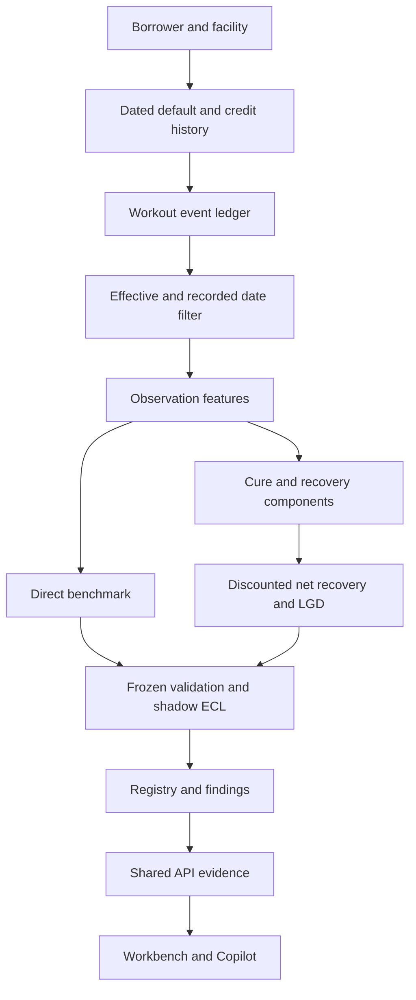

# WN-1 workout reference architecture

This is a bounded research closeout, not a promoted LGD model. Historical V5, R1 and MI artifacts are preserved. The component challenger fails promotion; the active PD/staging/LGD/EAD/ECL scorer remains unchanged.

## Evidence chain

Reviewed baseline `7773beb86df8480d964daaaf62199cedc15d356a` → completed MI `20595b33a121acd1148aac704ea1e9ab83171936` → methodology reconstruction and preregistration `4522129` → DGP code `3f6bcca` → dataset freeze `bf2c232` → fitted model freeze `c80f305` → one final evaluation. No model search, refit or population regeneration followed the final opening.

Read [protocol](PROTOCOL.md), [methodology reconstruction](CURRENT_LGD_METHODS.md), [external evidence](EVIDENCE_REGISTER.md), [feature contract](FEATURE_CONTRACT.md), [findings](FINDINGS.md), and the repository [authoritative closeout](../WORKOUT_PLATFORM_CLOSEOUT.md).

## Architecture and lineage



All 16 event entities reference a facility; facilities reference borrowers. Events retain ID, business date, recorded date, source, nonnegative amount and typed-by-contract JSON payload. `store.py` defines the additive `WN-1` SQLAlchemy schema, separate from platform Alembic `0002`. The platform's historical schema is not migrated into a different interpretation. `persist.py` loads the namespace in one transaction, rejects already populated stores, checks exact record counts, and never overwrites a dataset. Database administrative updates are not cryptographically prevented; deployment grants and backups remain necessary. This is a schema lifecycle, not an enterprise migration service.

The ledger includes predefault credit history, default, valuation, enforcement, guarantee claims, cash recovery, costs, suspended interest, restructuring, cure, writeoff and resolution. Features require both effective date and recorded date no later than observation. Outcome cashflows never enter features. Future cure and resolution are labels only. Cure simulation pays the remaining obligation and records subsequent credit snapshots; this is a simplifying paid-cure assumption, not the active staging cure policy.

### Model and accounting

Remaining EAD is default principal plus predefault accrued interest less recoveries already received. Suspended postdefault interest is a memorandum balance, excluded from EAD and future recoveries. Writeoff is noncash. Future cash recoveries less separate workout costs are discounted at the fixed facility rate. Raw loss ratios and bounded [0,1] targets are both retained.

The component model estimates cure probability, conditional discounted recovery shares across six channels, discounted costs and a separate log-time-to-resolution diagnostic. Recovery shares are capped collectively to avoid allocating more than the remaining exposure. Timing is already embedded in discounted targets; the timing regression is not used a second time to discount them. The model does not separately estimate each channel's occurrence probability or a full survival-adjusted outcome. Kaplan–Meier is descriptive only.

The simulator represents one facility/default per borrower, multiple vintages, independent administrative censoring and latent uncertainty. It is structurally informed by public templates, not empirically calibrated on institutional data. The portfolio is conditional on default; it does not estimate population default incidence.

## Run and inspect

Use Python 3.12. From repository root:

```bash
python -m venv .venv
# Linux/macOS: source .venv/bin/activate
# Windows PowerShell: .venv\Scripts\Activate.ps1
python -m pip install -r requirements-platform-lock.txt
python -c "from workout_vnext.experiment import verify; verify(); from credit_platform.workout_evidence import get; get()"
python -m pytest -q
```

The repository already contains frozen data and models. Do not run `generate`, `fit` or `evaluate` over them: these commands deliberately refuse to overwrite/reopen evidence. Review stored results or reproduce an experiment in a new isolated checkout and separately named output location, without substituting results for the frozen record.

For a fresh local reference application:

```bash
python scripts/run_v5.py
python -m credit_platform.cli build-models
python -m alembic upgrade head
python -m credit_platform.cli issue-token --name demo --role analyst
python -m credit_platform.cli run-reference --operator demo
python -m credit_platform.cli seed-governance
python -m uvicorn credit_platform.api:app --host 127.0.0.1 --port 8000 --no-access-log --log-config deployment/logging.json
```

Keep the issued token locally; enter it in the workbench at `http://127.0.0.1:8000`. Do not commit tokens. The default SQLite platform database is local and ignored. For PostgreSQL set `DATABASE_URL` before migrations and use the deployment guidance in `REPRODUCIBILITY.md`. The WN namespace can share that PostgreSQL database or use a separate database:

```bash
# Linux/macOS
export WORKOUT_DATABASE_URL=sqlite:///workout.db
python -m workout_vnext.persist
# PowerShell equivalent: $env:WORKOUT_DATABASE_URL="sqlite:///workout.db"
```

The WN loader can also accept a `postgresql+psycopg://...` URL through the environment. No credentials belong in tracked commands. As-of retrieval is available through `workout_vnext.store.asof(connection, facility_id, ISO_date)`; no unauthenticated workout-data API is added.

### UI and governed evidence

Open a successful run for scored borrower/facility counts, stage/industry/product/rating/risk-direction composition and decision traces. The complete portfolio aggregation comes from the backend; the displayed facility table is limited to 500 and says so. WN-1 validation has its own authenticated read-only tab. It cannot replace the active scorer.

Copilot and dashboard consume the same `service.portfolio` response. Counts distinguish borrowers from facilities. Industry attention is explicitly ranked by reference ECL, not described as causal or forecast deterioration. Single-run questions about changes are declined as insufficient temporal evidence; use the existing two-run movement endpoint. Optional external narration falls back to exact deterministic rendering unless the response matches that rendering. Thus the release does not claim demonstrated open-ended GenAI reasoning.

## Monitoring and escalation

Use `results/feature_population.csv`, `support.csv`, `guarantee_support.csv`, `segments.csv`, `calibration.csv`, `survival.csv`, `cure_validation.json` and the ECL bridge. These are reproducible frozen-cohort monitoring diagnostics, not a deployed scheduler. Reject missing/invalid feature values using `contracts.check`. Reject out-of-contract categories. Any training-range violation, new missingness, stress reversal or absent real source capture blocks promotion and opens/retains a finding. Bias-equivalence gates retain 1 pp overall and 2 pp material segments with clustered intervals; n<100 is insufficient. Recovery timing and cure proportions are reviewed descriptively; no invented universal drift threshold is imposed. Distribution shifts require analysis, not automatic re-calibration or model promotion.

## Release and recovery

The risk engine, API and governed reference workflow are the delivery surface. WN research runs remain outside active scoring. Rollback consists of deploying the reviewed baseline, leaving the WN ledger/evidence intact. Back up databases before migrations. The WN ledger is rebuildable from hash-frozen source archives; platform database audit/override/run history must be backed up separately. Follow the existing deployment recovery guide. Synthetic success is not bank approval.
